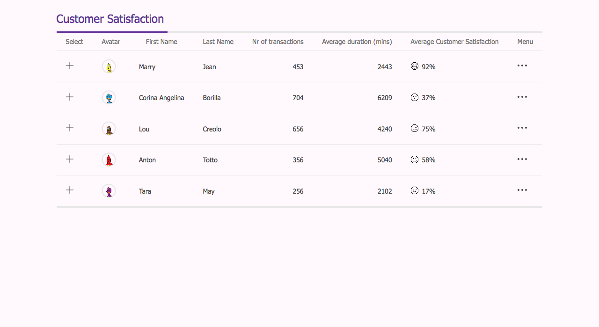
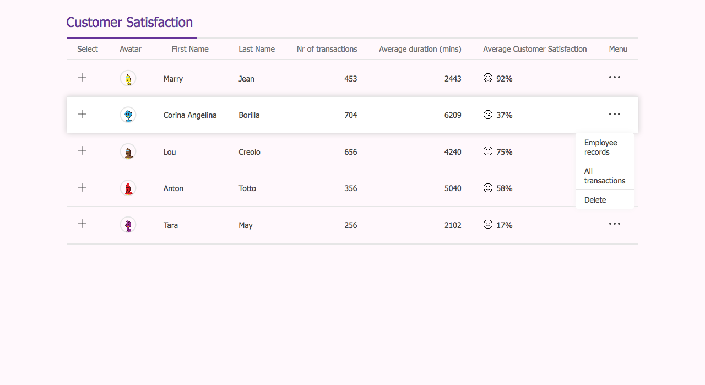

# Customer Satisfaction Dashboard

Taking advantage of everything we've learned in this module, create a customer satisfaction dashboard as shown in the mockup below:

### Specifications

> - centered on page
> - header underline effect
> - satisfaction number with icon -> vertically centered
> - employee avatar
> - columns that contain numbers are aligned right
> - there is a hover effect when hovering on different rows
> - dropdown on hover of icon

#### Optional

- sticky header -> see what issues you might run into
- responsive -> no overflow of entire page
- split column header

  

> Note: You can use `https://robohash.org/` for the avatar images.
> Specify any string after the URL to get a random robot avatar:
> `https://robohash.org/marry` or `https://robohash.org/lou` or even `https://robohash.org/fghjklhgfhj`.
